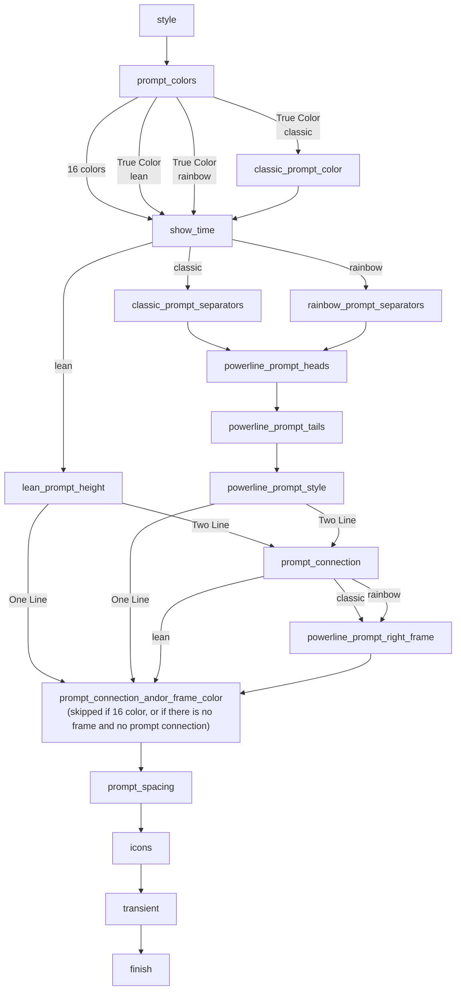

# Architecture

## Tide Configure Flowchart

```mermaid
flowchart TD

prompt_connection_andor_frame_color["prompt_connection_andor_frame_color
(skipped if 16 color, or if there is no frame and no prompt connection)"]

Style[style] --> prompt_colors

prompt_colors -- "16 colors" --> show_time
prompt_colors -- "True Color \n lean" --> show_time
prompt_colors -- "True Color \n rainbow" --> show_time
prompt_colors -- "True Color \n classic" --> classic_prompt_color

classic_prompt_color --> show_time

show_time -- "lean" --> lean_prompt_height
show_time -- "classic" --> classic_prompt_separators
show_time -- "rainbow" --> rainbow_prompt_separators

lean_prompt_height -- "One Line" --> prompt_connection_andor_frame_color
lean_prompt_height -- "Two Line" --> prompt_connection

classic_prompt_separators --> powerline_prompt_heads
rainbow_prompt_separators --> powerline_prompt_heads

powerline_prompt_heads --> powerline_prompt_tails
powerline_prompt_tails --> powerline_prompt_style

powerline_prompt_style -- "One Line" --> prompt_connection_andor_frame_color
powerline_prompt_style -- "Two Line" --> prompt_connection

prompt_connection -- "lean" --> prompt_connection_andor_frame_color
prompt_connection -- "classic" --> powerline_prompt_right_frame
prompt_connection -- "rainbow" --> powerline_prompt_right_frame

powerline_prompt_right_frame --> prompt_connection_andor_frame_color

prompt_connection_andor_frame_color --> prompt_spacing

prompt_spacing --> icons

icons --> transient

transient --> finish
```
