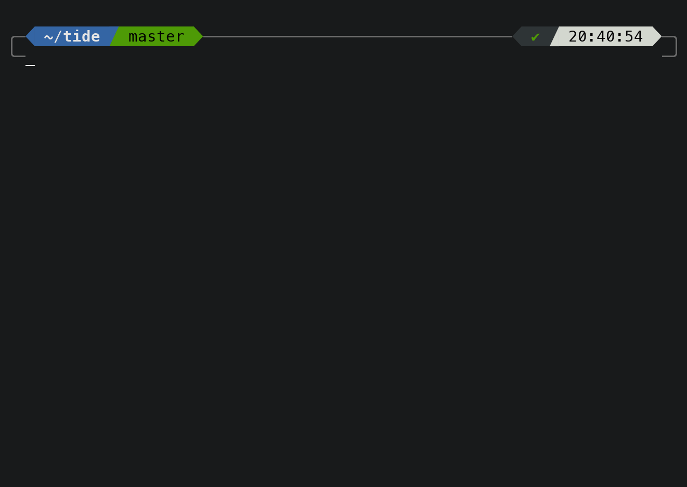

<div align="center">


[![ci_badge][]][actions] ​ [![fish_version_badge][]](#System-Requirements) ​ [![license_badge][]][license] <!-- 0 width spaces on this line -->

</div>

#


**A modern prompt manager for the [Fish][] shell.**

- **Out of the box:** With four compelling styles and myriad options, you can have your out-of-the-box cake and customize it too.
- **Flexible:** Move content around, remove it, or add it back, all without ever touching a line of code.
- **Powerful:** Impress all your Fish friends with alien technologies like a multi-line right prompt.
- **Extensible:** Create custom content with simple fish functions that integrate seamlessly.

<br clear="right">

## Installation

### System Requirements

- [Git][]
- [Fish][] ≥ 3.1
- A [Nerd Font][nerd fonts] installed and enabled in your terminal (for example the [recommended font](#fonts)).

Install with [Fisher][]:

```console
fisher install IlanCosman/tide
```

## Features

### Configuration Wizard

Run `tide configure` to open the the wizard in your terminal.

![configuration_wizard][]

<br>


### Flexible

Using the [`items`][] list for each side of the prompt, you have full control of which and where prompt sections display.

<br clear="left"><br>


### Multi-Line Right Prompt

> Fish can't do _that_ yet can it!

Tide takes care of all the multi-line logic and printing for you. All you have to do is add the `newline` item.

<br clear="right"><br>


### Extensible

If there isn't an item that fits your needs you can make your own (and hopefully submit a pull request) or ask for it to be made by opening an issue.

<br clear="left"><br>



### Pure Emulation

Tide can easily produce the same prompt as [Pure][] (with a number of improvements). Run `tide configure` and select the Pure style.

All of Tide's features are available while using Pure style, though it displays less information by default than Lean style.

<br clear="right">

## Configuration

See the [configuration guide][] for variable documentation.

## Contributing

From the smallest typo to the largest feature, contributions of any size or experience level are welcome!

If you're interested in helping contribute to Tide, please take a look at the [Contributing Guide][].

## Fonts

### Meslo Nerd Font

Gorgeous monospace font designed by Jim Lyles for Bitstream, customized for Apple, enhanced by André Berg, and finally patched by Roman Perepelitsa of [Powerlevel10k][] with scripts originally developed by Ryan McIntyre of [Nerd Fonts][]. Contains all the glyphs and symbols that Tide may need. Battle-tested in dozens of different terminals on all major operating systems.

### Font Installation

Download these four ttf files:

- [MesloLGS NF Regular.ttf][]
- [MesloLGS NF Bold.ttf][]
- [MesloLGS NF Italic.ttf][]
- [MesloLGS NF Bold Italic.ttf][]

Open each file and click "Install". This will make the `MesloLGS NF` font available to all applications on your system. Configure your terminal to use this font.

## Acknowledgments

- [Powerlevel10k][] - Inspired much of Tide's documentation, resources, ideas, and design.
- [Starship][] - Inspired elements of Tide's documentation and community health files.
- [Spacefish][] - Inspired some of Tide's items.

[`items`]: docs/Configuration.md#Items
[actions]: https://github.com/IlanCosman/tide/actions
[ci_badge]: https://github.com/IlanCosman/tide/workflows/CI/badge.svg
[configuration guide]: docs/Configuration.md
[configuration_wizard]: resources/animations/configuration_wizard.gif
[contributing guide]: CONTRIBUTING.md
[fish_version_badge]: https://img.shields.io/badge/fish-3.1.0%2B-blue
[fish]: https://fishshell.com/
[fisher]: https://github.com/jorgebucaran/fisher
[git]: https://git-scm.com/
[license_badge]: https://img.shields.io/github/license/IlanCosman/tide
[license]: LICENSE.md
[meslolgs nf bold italic.ttf]: https://github.com/IlanCosman/tide/raw/main/resources/fonts/mesloLGS_NF_bold_italic.ttf
[meslolgs nf bold.ttf]: https://github.com/IlanCosman/tide/raw/main/resources/fonts/mesloLGS_NF_bold.ttf
[meslolgs nf italic.ttf]: https://github.com/IlanCosman/tide/raw/main/resources/fonts/mesloLGS_NF_italic.ttf
[meslolgs nf regular.ttf]: https://github.com/IlanCosman/tide/raw/main/resources/fonts/mesloLGS_NF_regular.ttf
[nerd fonts]: https://github.com/ryanoasis/nerd-fonts
[powerlevel10k]: https://github.com/romkatv/powerlevel10k/
[pure]: https://github.com/rafaelrinaldi/pure
[spacefish]: https://github.com/matchai/spacefish
[starship]: https://github.com/starship/starship
